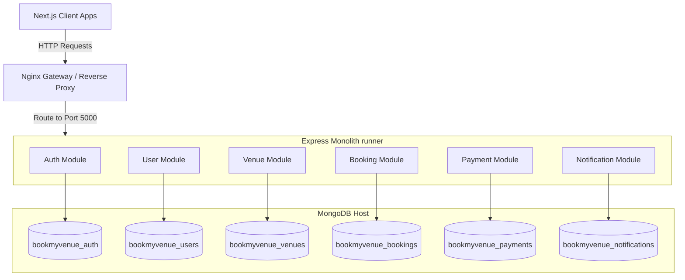

# BookMyVenue Architecture Documentation

## Architectural Overview

BookMyVenue is structured as a **Modular Monolith**. It is composed of a single runner codebase (`backend/`) that integrates multiple self-contained modules (`backend/src/modules/*`).

## System Rules & Guidelines

### 1. Database Isolation

- Each module has its own connection via Mongoose and connects to a **separate database** (e.g. `bookmyvenue_auth`, `bookmyvenue_venues`).
- Modules **must not** perform joins or direct queries on collections belonging to another module.
- If data from another module is required, it must be fetched via their public service class/interface.

### 2. Microservice Preparedness

- Avoid tight coupling between modules.
- Keep module routers self-contained.
- All routing prefixes should follow `/api/v1/<module-name>/*`.
